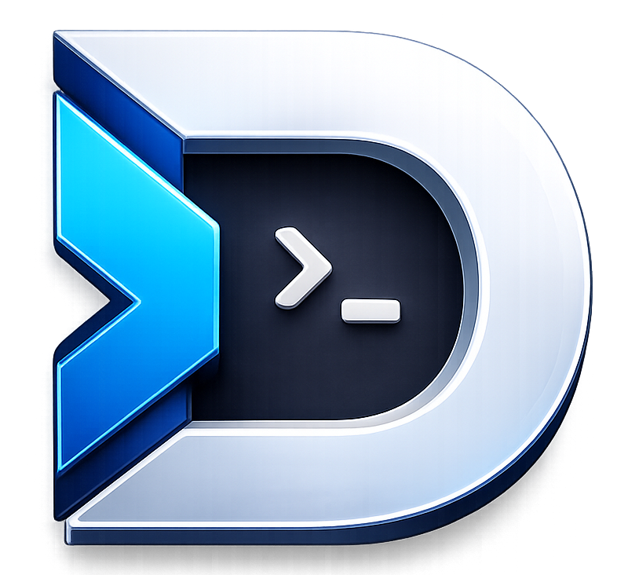
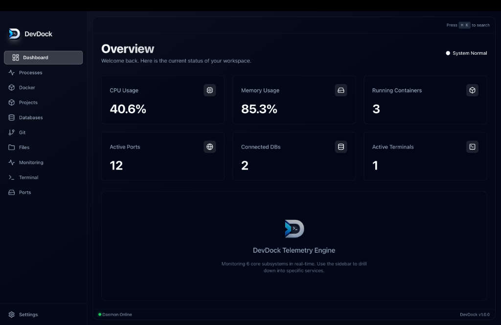
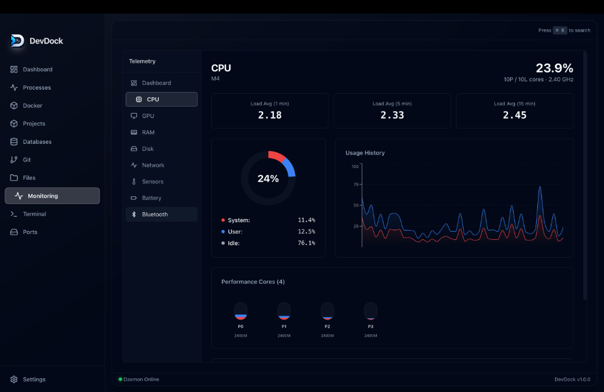
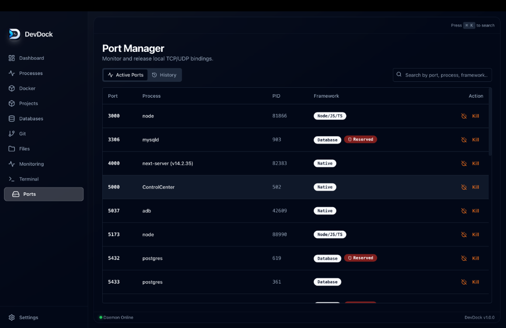
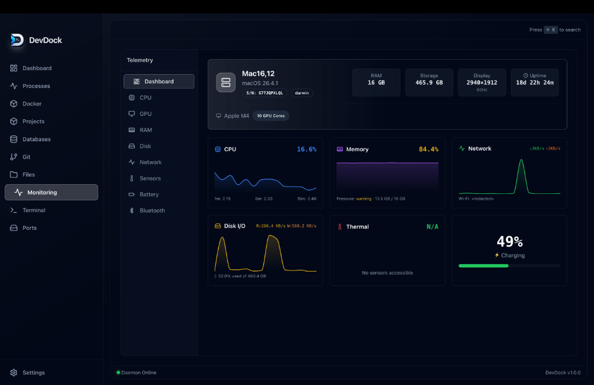

<div align="center">
  
  <h1>DevDock 🚢</h1>
  <p><strong>The Colossal, Unified Desktop Application Engineered for Modern Developers</strong></p>

  <a href="https://github.com/mdtanvirahamedshanto/DevDock/actions/workflows/build-release.yml">
    
  </a>
  <a href="https://github.com/mdtanvirahamedshanto/DevDock/releases/latest">
    
  </a>
  <a href="./LICENSE">
    
  </a>
  
</div>

<br/>

DevDock aims to completely replace the fragmented developer tooling ecosystem (Task Manager, Docker Desktop, Database Clients, Terminals, System Monitors) with **one visually stunning, high-performance interface.**

Built with **Electron**, **React**, **Zustand**, **Shadcn UI**, and a massively scalable **Pnpm TurboRepo** architecture.

---

## 📥 Download

DevDock is automatically compiled for macOS, Windows, and Linux.

> **[👉 Download the latest release here](https://github.com/mdtanvirahamedshanto/DevDock/releases/latest)**

- **macOS**: `.dmg` (Universal)
- **Windows**: `.exe` (NSIS Installer)
- **Linux**: `.AppImage` (Universal) or `.deb`

---

## 🌟 Master Feature List

1. **System Monitoring**: A 60-FPS push-based telemetry engine tracking CPU (per-core GHz/Load), RAM (macOS Memory Pressure/Swap), Network I/O, and physical disk S.M.A.R.T status in real-time. Includes a frameless system tray popup dashboard!
2. **Process Manager**: A native task manager (kill, suspend, resume) via `ps-list` IPC hooks.
3. **Port Manager**: Maps active TCP/UDP ports, detects conflicts, and force-kills locking processes.
4. **Project Manager**: Recursively scans workspaces, automatically detects frameworks (Next.js, Vue, Laravel), and manages Env files and Node instances.
5. **Database Center**: Built-in connection manager for MySQL and PostgreSQL. Provides a SQL execution terminal and schema viewer!
6. **Docker Manager**: Interacts natively with the Docker daemon (`/var/run/docker.sock`) to manage containers, images, volumes, and networks.
7. **Git Interface**: Wraps `simple-git` for visual commits, pushing, pulling, and branch switching directly within your workspace roots.
8. **File Manager (Disk Sweeper)**: A multi-threaded scanner that deeply crawls for large files and clusters identical files via MD5 byte-hashing for instant deduplication.
9. **Terminal Emulator**: Integrates `node-pty` and `xterm.js` to spawn authentic, native local Zsh/Bash/PowerShell multi-tab instances.

---

## 📸 Screenshots

### Dashboard Overview



### System CPU & Memory Monitor



### Active Port Manager



### Hardware Telemetry



---

## 🚀 Installation & Development Build

Want to contribute or run DevDock from source? It's easy:

```bash
# 1. Clone the repository
git clone https://github.com/mdtanvirahamedshanto/DevDock.git

# 2. Install dependencies (requires Pnpm)
pnpm install

# 3. Start the TurboRepo dev servers (React frontend + Electron backend)
pnpm run dev
```

### Packaging Locally

You can manually trigger the `electron-builder` packages on your own machine:

```bash
# Build for your current OS:
pnpm run package:mac
# Or package:win, package:linux
```

---

## 🏗️ Architecture

DevDock utilizes a highly modular **TurboRepo** architecture. The `apps/desktop` package acts purely as a UI renderer and an IPC router. All actual operating system logic is strictly isolated into independent node modules:

- `@devdock/core`: App Recovery, Logging, Global Events.
- `@devdock/ui`: Shadcn/Radix primitive components.
- `@devdock/system`, `@devdock/processes`, `@devdock/monitoring`: Native OS telemetry engines.
- `@devdock/projects`, `@devdock/files`: High-performance filesystem crawlers.
- `@devdock/database`, `@devdock/docker`, `@devdock/git`: Wrappers for external developer tooling.

---

## 🤝 Contributing

DevDock is an open-source project and we love contributions! Please read our [Contributing Guidelines](CONTRIBUTING.md) to get started.

We also expect all contributors to adhere to our [Code of Conduct](CODE_OF_CONDUCT.md).

## 🛡️ License

This project is licensed under the MIT License - see the [LICENSE](LICENSE) file for details.
